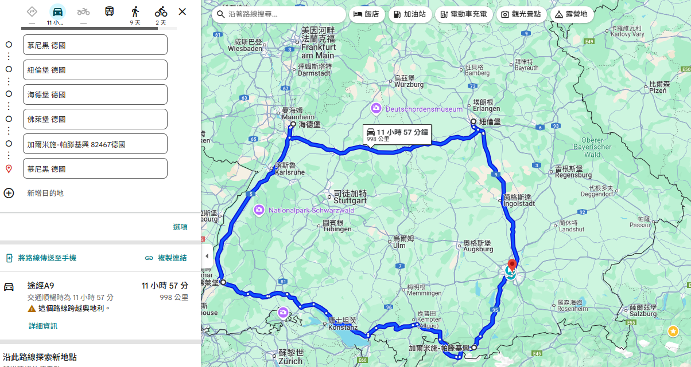

# 從慕尼黑出發, 網友推薦必去的景點打星號並括弧說明重點

## [Google Map](https://www.google.com/maps/place/%E5%BE%B7%E5%9C%8B%E7%B4%90%E5%80%AB%E5%A0%A1/@49.4494084,10.8608138,12z/data=!4m65!1m58!4m57!1m6!1m2!1s0x479e75f9a38c5fd9:0x10cb84a7db1987d!2z5b635ZyL5oWV5bC86buR!2m2!1d11.5819805!2d48.1351253!1m6!1m2!1s0x479f57aeb5b61cd3:0xdd5daf85a98c21b7!2z5b635ZyL57SQ5YCr5aCh!2m2!1d11.0745641!2d49.4542881!1m6!1m2!1s0x47a2902012da4dd9:0x41db728f06209a0!2z54OP6Iyy5aChIFfDvHJ6YnVyZw!2m2!1d9.9533548!2d49.7913044!1m6!1m2!1s0x47988efdf06dff37:0x41eda32beb5f5c0!2zOTE1NDEg576F5ruV5aCh5b635ZyL!2m2!1d10.1867388!2d49.3801834!1m6!1m2!1s0x4797c1050eccdccd:0xefe6ea0044243ad7!2z5b635ZyL5rW35b635aCh!2m2!1d8.6724335!2d49.3987524!1m6!1m2!1s0x47911b26560bd665:0x41f6bb7a5df57b0!2z5b635ZyL5byX6JCK5aCh!2m2!1d7.8421043!2d47.9990077!1m6!1m2!1s0x479d0160938a3329:0x41e48add78b9c80!2zR2FybWlzY2gtUGFydGVua2lyY2hlbiwg5b635ZyL!2m2!1d11.0947806!2d47.4919023!1m6!1m2!1s0x479e75f9a38c5fd9:0x10cb84a7db1987d!2z5b635ZyL5oWV5bC86buR!2m2!1d11.5819805!2d48.1351253!3e0!3m5!1s0x479f57aeb5b61cd3:0xdd5daf85a98c21b7!8m2!3d49.4542881!4d11.0745641!16zL20vMDVia2Y?authuser=0&entry=ttu&g_ep=EgoyMDI1MDcxNi4wIKXMDSoASAFQAw%3D%3D "慕尼黑-紐倫堡-海德堡-弗萊堡-加爾米施-帕滕基興-慕尼黑")

以下依您從**慕尼黑出發**的路線順序，將之前提及的城市及景點依自駕順路方向排列，並在每個景點前附上可勾選的方框。**網友推薦必去的景點以星號標示**，並在括號內簡述重點，方便您規劃行程時勾選與參考。

### 慕尼黑 Munich（起點）

- [X] ★ **瑪利亞廣場（Marienplatz）**（慕尼黑老城中心，哥德式新市政廳與鐘琴表演，冬季氣氛濃厚）
- [X] ★ **寧芬堡宮（Nymphenburg Palace）**（巴洛克宮殿，冬季花園景觀優美）
- [X] ★ **BMW博物館**（汽車文化與科技展覽，適合車迷）
- [ ] 奧林匹克公園（冬季戶外活動與城市景觀）
- [ ] 德意志博物館（世界最大科技博物館，適合室內參觀）
- [ ] 慕尼黑國家美術館（Alte Pinakothek，歐洲古典藝術收藏）
- [X] 冬季溜冰場（市區多處開放，親子活動佳）
- [ ] 啤酒屋體驗（品嘗巴伐利亞啤酒與傳統料理）
- [ ] 聖母教堂（Frauenkirche，慕尼黑地標哥德式教堂）
- [ ] 美茵塔觀景台（360度俯瞰慕尼黑冬季城市景觀）

### 楚格峰 Zugspitze（距離慕尼黑約90公里，約1.5小時車程）

- [X] ★ **齒軌列車登頂**（德國最高峰，搭乘齒軌列車欣賞阿爾卑斯雪景）
- [X] ★ **纜車登頂體驗**（多條纜車路線，冬季風光壯麗）
- [X] ★ **冰川滑雪場**（德國頂級滑雪場，適合各種滑雪水平）
- [X] 冰洞探險（Eis Palast，冰川內部奇觀）
- [ ] 山頂觀景台（360度全景俯瞰德奧義瑞阿爾卑斯）
- [ ] 雪地健行路線（多條冬季健行路線）
- [X] 山頂餐廳用餐（享受巴伐利亞特色料理）
- [ ] 滑雪學校（初學者滑雪課程）
- [ ] 雪橇滑道（適合家庭與兒童）
- [X] 日出觀賞與冬季攝影（早晨登頂觀看壯麗日出）

### 新天鵝堡 Schloss Neuschwanstein（距離楚格峰約60公里，約1小時車程）

- [X] ★ **新天鵝堡城堡導覽**（巴伐利亞國王路德維希二世夢幻城堡，冬季雪景浪漫）
- [X] ★ **瑪麗橋（Marienbrücke）觀景台**（拍攝城堡全景絕佳位置）
- [X] 舊天鵝堡（Hohenschwangau Castle，路德維希二世童年居所）
- [ ] 阿爾卑斯湖（Alpsee）健行（冬季湖畔雪景迷人）
- [X] 菲森老城區漫步（典型巴伐利亞小鎮風情）
- [ ] 冬季雪地健行路線（城堡周邊多條步道）
- [X] 馬車上山體驗（冬季傳統交通方式，減輕步行疲勞）
- [X] 菲森城堡（Hohes Schloss，中世紀城堡）
- [ ] 巴伐利亞博物館（Museum of the Bavarian Kings，了解王室歷史）
- [ ] 冬季攝影活動（利用雪景與晨霧拍攝夢幻畫面）

### 羅騰堡 Rothenburg ob der Tauber（距離新天鵝堡約190公里，約2.5小時車程）

- [X] ★ **古城牆漫步**（保存完整的中世紀城牆與塔樓，冬季景色迷人）
- [X] ★ **Plönlein 拍照點**（童話般的經典街景）
- [X] 聖雅各教堂（哥德式教堂，彩繪玻璃藝術）
- [ ] 中世紀犯罪博物館（獨特歷史展覽）
- [ ] 克林格爾博物館（當地文化展示）
- [X] 羅騰堡聖誕博物館（體驗德國聖誕文化）
- [ ] 城門塔樓登高（欣賞冬季小鎮全景）
- [X] 古城石板街漫步（冬季悠閒散步）
- [ ] 當地餐廳品嘗巴伐利亞美食（豬腳、啤酒等）
- [X] 市集廣場（Marktplatz，冬季浪漫街景）

### 紐倫堡 Nürnberg（距離羅騰堡約100公里，約1.5小時車程）

- [X] ★ **紐倫堡城堡**（古堡冬季景色壯麗，城市地標）
- [X] 玩具博物館（特色展覽，適合家庭）
- [X] 老城區漫步（冬季寧靜風光）
- [ ] 聖洛倫茲教堂（哥德式建築）
- [X] 班堡 Bamberg（約45分鐘車程，小威尼斯風情與啤酒文化）
- [X] 紐倫堡交通博物館（適合親子）
- [ ] 紐倫堡博物館（歷史與藝術收藏）
- [ ] 城市公園（冬季散步好去處）
- [X] 紐倫堡聖誕博物館（冬季文化體驗）
- [ ] 當地餐廳品嘗傳統德國料理

### 海德堡 Heidelberg（距離紐倫堡約230公里，約2.5小時車程）

- [X] ★ **海德堡城堡參觀**（文藝復興風格城堡，冬季雪景壯麗）
- [X] ★ **老橋（Alte Brücke）漫步**（跨越內卡河，冬季河景迷人）
- [X] 大學廣場（歷史悠久，冬季氣氛濃厚）
- [X] 哲學家之路（Philosophenweg）健行（俯瞰城市與河谷）
- [X] 海德堡大學博物館（德國最古老大學歷史）
- [ ] 聖靈教堂（哥德式教堂）
- [ ] 內卡河遊船（視冬季天氣開放）
- [X] 冬季市集與節慶活動（雖過聖誕，仍有冬季特色）
- [X] 老城區石板街漫步（古色古香，適合悠閒散步）
- [ ] 當地咖啡館與餐廳體驗（德國南部特色料理與熱飲）

### 法蘭克福 Frankfurt（距離海德堡約90公里，約1小時車程）

- [X] ★ **羅馬廣場（Römerberg）**（法蘭克福舊城中心，中世紀建築與冬季街景）
- [ ] ★ **美茵塔（Main Tower）觀景台**（摩天大樓俯瞰冬季城市景觀）
- [ ] 法蘭克福鐵橋（Eiserner Steg，冬季夕陽與夜景浪漫）
- [ ] 法蘭克福皇帝大教堂（哥德式建築，登頂俯瞰城市）
- [ ] 施泰德藝術館（Städel Museum，室內文化藝術）
- [ ] 棕櫚園（Palmengarten，溫室熱帶植物）
- [X] Zeil采爾大街購物（冬季折扣季）
- [X] MyZeil購物中心（現代建築與美食）
- [X] 歌德故居（文學巨匠故居）
- [ ] 法蘭克福城市森林（冬季健行與賞雪）

此路線由南向北，從慕尼黑出發，經楚格峰、新天鵝堡、羅騰堡、紐倫堡、海德堡，最後抵達法蘭克福，符合自駕順路且每日車程合理的規劃。您可依此列表勾選想去的景點，方便安排每日行程。

如需進一步協助安排每日詳細路線或住宿建議，歡迎隨時告知！

⁂

[^1]: https://www.ggogo.com/ggogoWeb/goProd.do?step=goStep1\&mgrupCd=NBL10Z
    
[^2]: https://travel.liontravel.com/detail?normgroupid=929db0ab-3d19-4f3b-b346-3119e5e5c554
    
[^3]: https://www.itours.com.tw/TOU/TOU0020/EOE1000327/EOE022010BR23B
    
[^4]: https://tour.settour.com.tw/product/GFG0000028130
    
[^5]: https://event.pktravel.com.tw/EW/GO/MGroupDetail.asp?prodCd=FRA10CI1106
    
[^6]: https://tour.lifetour.com.tw/detail/MUC10BRT02
    
[^7]: https://travel.liontravel.com/detail?normgroupid=4f95b136-86e1-4510-94c8-e321eeaf65a9
    
[^8]: https://www.colatour.com.tw/C10A_TourSell/C10A16_TourItinerary.aspx?PatternNo=226802
